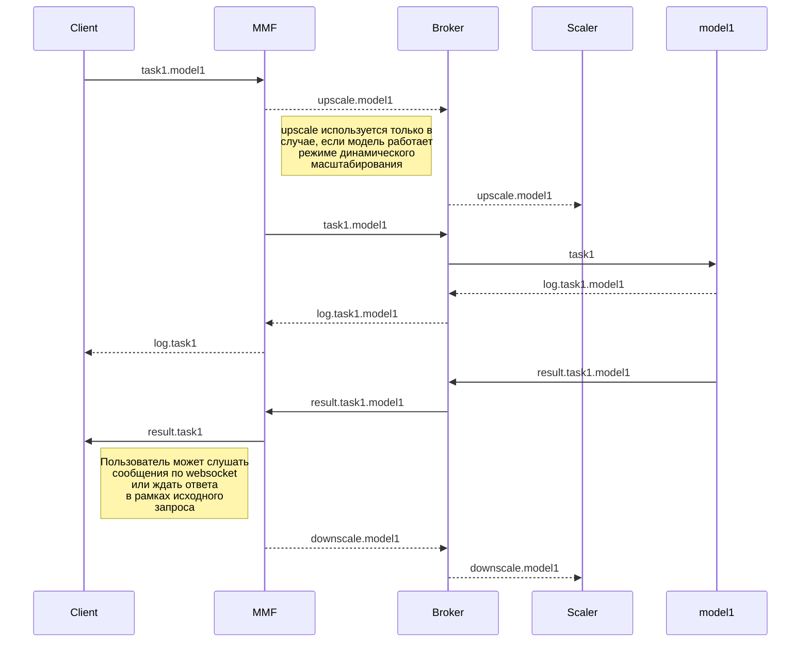

# Режимы
Каждый проект в MMF - это сервис. Клиент направляет задачу в сервис и ожидает ответ. Внутри MMF задача
проходит такой путь:


## Динамический scale
Модели могут быть настроены в режиме динамического скейлинга. Это означает, что для каждой задачи формируется запрос на
выделение дополнительных ресурсов и по завершении задачи - ресурсы высвобождаются, предоставляя возможность
другим задачам быть исполнеными. При этом есть общий пул ресурсов, из которых скейлер "выбирает" свободные и так же
ограничения как по максимальному кол-ву выделяемых на одну модель ресурсов, так и по минимальному.

Запрос на scale увеличивает кол-во "желаемых" реплик модели, запрос на down - уменьшает. При этом 
каждое изменение желаемого или текущего состояния доступных ресурсов приводит к фактическому перераспределению 
ресурсов. Таким образом достигается максимальная утилизация доступных ресурсов при минимальных затратах
на их перераспределение.

## Безопасность

Секретные части приложения защищаются токеном, подписанным с использованием асимметричного шифрования 
([Ed25519](https://cryptography.io/en/latest/hazmat/primitives/asymmetric/ed25519/))

Токен содержит информацию о разрешениях и срок. Этот токен выдает центральный сервер с указанием срока действия. 
Токен подписывается с использованием приватного Ed25519-ключа. Сервер с моделью проверяет разрешения, срок и
подпись с использованием публичного ключа. Токен - закодированный объект (с помощью ptotobuf) следующего вида:
```yaml
user_id: 1234  # id пользователя
project_id: 1456 # id проекта
methods: score,train # указываются методы, которые пользователь имеет право использовать
exp: 2021-01-05 20:45:15 # время до которого подпись валидна, после этого времени токен нужно обновить
```
Поскольку токен передается в заголовке, он так же кодируется в base64

Благодаря такой схеме нет необходимости в коммуникации между центральным сервером и контейнером с моделью, пользователь
обращается к модели напрямую без посредников, что значительно сокращает издержки на балансировку системы.

Очередь rabbitmq устроена таким образом, что каждой модели выделяется свой пользователь с доступом только к тем ресурсам, 
которые касаются работы только этой модели. Это означает, что модель не способна ни прослушать чужие сообщения, ни испортить
работу соседней очереди.

